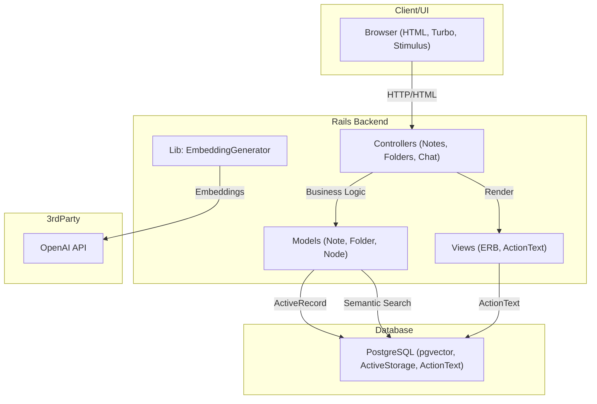

## Project Overview

- **Project Name:** Connectivity
- **Description:**
  This is an educational pet project built to explore and learn how to integrate OpenAI's API with a Ruby on Rails web application. The app demonstrates Rails + OpenAI integration, handling form submissions, and displaying dynamic AI responses.
- **Main Features:**
  - Simple web UI using Tailwind CSS
  - Form to send a message to OpenAI Chat
  - Displays both user input and AI response
  - Notes and folders management with semantic search
  - Integration with OpenAI for note creation and embedding

---

## Architecture Overview

The application follows a classic MVC (Model-View-Controller) architecture using Ruby on Rails. The backend serves both HTML and JSON endpoints, manages business logic, and interacts with a PostgreSQL database (with pgvector extension for vector search). The frontend is rendered server-side with ERB templates, styled using Tailwind CSS, and enhanced with Hotwire (Turbo/Stimulus) for interactivity.

- **Design Patterns/Principles:**
  - MVC (Model-View-Controller)
  - RESTful routing
  - Service Object (for embedding generation)
  - DRY and convention-over-configuration (Rails defaults)

### System Diagram
- **Diagram:**

- **Explanation:**
  - The browser interacts with Rails controllers via HTTP.
  - Controllers handle business logic, interact with models, and render views.
  - Models use ActiveRecord to persist data in PostgreSQL, including vector embeddings for semantic search.
  - The `EmbeddingGenerator` service calls the OpenAI API to generate embeddings for notes.
  - ActionText and ActiveStorage are used for rich text and file attachments.

---

## Front End/Client Side

- **UI**
  - Main pages:
    - **Notes Index:** List/search notes, create new notes/folders, access chat.
    - **Note Show:** View note details, edit, or delete.
    - **Folders Index:** List folders, create new folders.
    - **Folder Show:** View folder details, subfolders, and notes.
    - **Chat:** Send messages to OpenAI, view chat history.
  - Cross-cutting concerns:
    - State is managed via Rails session and instance variables.
    - No evidence of client-side routing or state management libraries.
    - Turbo/Stimulus used for SPA-like interactivity.

- **Structure**
  - Views are organized by resource (`notes`, `folders`, `chat`), with partials for forms and lists.
  - Layouts provide a consistent header and container.
  - JavaScript is managed via import maps and Stimulus controllers in `app/javascript/controllers`.
  - Styles are managed with Tailwind CSS and ActionText CSS for rich content.

---

## Back End/Service Side

- **Bootstrap**
  - Standard Rails bootstrapping via `config/application.rb`, `config/boot.rb`, and `Rakefile`.
  - Uses Puma as the web server.
  - Dockerfile provided for containerized deployment.

- **Contract**
  - RESTful API endpoints for notes and folders:
    - `GET /notes`, `POST /notes`, `GET /notes/:id`, `PATCH/PUT /notes/:id`, `DELETE /notes/:id`
    - `GET /folders`, `POST /folders`, `GET /folders/:id`, `PATCH/PUT /folders/:id`, `DELETE /folders/:id`
  - Chat endpoints:
    - `GET /chat` (chat UI)
    - `POST /chat` (send message to OpenAI, create note via AI)
  - Health check: `GET /up`
  - Root: `notes#index`

- **App Layers**
  - **Controllers:** `NotesController`, `FoldersController`, `ChatController`, `ApplicationController`
  - **Models:** `Note`, `Folder`, `Node` (with single-table inheritance), rich text via ActionText
  - **Lib:** `EmbeddingGenerator` for OpenAI embedding calls
  - **Helpers:** Application, notes, and folders helpers for view logic

- **Infra**
  - Uses ActiveStorage for file uploads (local disk in dev/test)
  - Uses ActionText for rich text content
  - Uses pgvector for vector search in PostgreSQL
  - No evidence of background jobs beyond the default `ApplicationJob`

- **3rd Parties**
  - OpenAI API (note creation, embeddings)
  - PostgreSQL (with pgvector extension)
  - Tailwind CSS (styling)
  - Hotwire (Turbo, Stimulus for frontend interactivity)

---

## Technology Stack

- **Frontend:**
  - Frameworks/Libraries: Hotwire (Turbo v2.0.13, Stimulus v1.3.4), ActionText, ERB templates
  - Styling: Tailwind CSS v4.2.3
  - State Management: [No dedicated client-side state management library]

- **Backend:**
  - Language/Framework: Ruby 3.2.3, Rails 7.1.5.1
  - API: RESTful services via Rails controllers

- **Database:**
  - Primary Database: PostgreSQL (version not specified, but pgvector requires 13+)
  - Cache: [Information not found in codebase]

- **Other Tools & Services:**
  - Containerization: Docker (Dockerfile provided)
  - Message Queue: [Information not found in codebase]
  - Search: pgvector for vector similarity search
  - CI/CD: [Information not found in codebase]

---

## Project Structure

```plaintext
├── app/
│   ├── controllers/       # Rails controllers (Notes, Folders, Chat, Application)
│   ├── models/            # Data models (Note, Folder, Node, ApplicationRecord)
│   ├── views/             # ERB templates for UI, organized by resource
│   ├── helpers/           # View helpers
│   ├── assets/            # Stylesheets, images, Tailwind config
│   ├── javascript/        # Stimulus controllers, JS entrypoints
│   ├── jobs/              # ApplicationJob (default)
│   ├── mailers/           # ApplicationMailer (default)
│   ├── channels/          # ActionCable (default, not customized)
├── bin/                   # Rails and custom binstubs
├── config/                # Rails configuration, routes, environments, initializers
├── db/                    # Migrations, schema, seeds
├── lib/                   # Custom libraries (EmbeddingGenerator)
├── log/                   # Log files
├── public/                # Static files, error pages, favicon
├── storage/               # ActiveStorage files (local)
├── tmp/                   # Temp files
├── vendor/                # [Empty or not used]
├── Dockerfile             # Docker build instructions
├── Gemfile, Gemfile.lock  # Ruby dependencies
├── Procfile.dev           # Foreman process file for development
├── README.md              # Project overview and setup
└── ai-overview.md         # This overview documentation file
```

---

## Environment Configurations

- **Environments:**
  - Development: Local setup for testing and development
  - Staging: [Information not found in codebase]
  - Production: Live, user-facing environment

- **Configuration Management:**
  - Uses Rails credentials and environment variables (e.g., `CONNECTIVITY_PASSWORD` for DB)
  - No `.env.example` file found; configuration is managed via Rails conventions and Dockerfile

- **Setup Instructions for local development:**
  1. Install dependencies with `bundle install`
  2. Set up the database with `bin/rails db:setup`
  3. Start the app with `bin/rails server` or use `Procfile.dev` with Foreman
  4. For Docker: build and run using the provided Dockerfile

---

## Security

- **Authentication:**
  [Information not found in codebase]

- **Authorization:**
  [Information not found in codebase]

- **Data Encryption:**
  - Rails uses encrypted credentials for secrets
  - No explicit mention of TLS or at-rest encryption in codebase

- **Security Tools:**
  - Content Security Policy and Permissions Policy initializers present but commented out
  - Sensitive parameters filtered from logs (`filter_parameter_logging.rb`)

---

## Deployment

- **Deployment Process:**
  - Dockerfile provided for containerized deployment
  - No explicit deployment scripts or cloud provider configuration found

- **CI/CD Pipeline:**
  [Information not found in codebase]

- **Tools Used:**
  - Docker for containerization
  - No deployment scripts found

---

## Testing

- **Testing Frameworks:**
  - RSpec is used for testing, with FactoryBot for test data generation.
  - Request specs are used to test controllers and endpoints.
  - The project does **not** use the `rails-controller-testing` gem, so tests do not use `assigns` or `render_template` matchers.
  - Instead, tests check for response status (e.g., `have_http_status(:ok)`) and for expected content in the response body.
  - No test or spec directories for Minitest are present.

- **Running Tests:**
  - Run all specs with: `bundle exec rspec`

- **Test Coverage:**
  - [Information not found in codebase: No coverage tools (e.g., SimpleCov) or CI integration detected.]

---

## Testing Best Practices

- Use request specs for end-to-end controller testing and avoid controller specs unless absolutely necessary.
- **Do not use the `action-controller-testing` gem**: It is not well maintained and may not be compatible with recent Rails versions. Prefer request specs and feature specs for controller-related tests.

---

## UI Framework

- **Framework/Library:**
  - Server-rendered HTML via Rails views (ERB)
  - Hotwire (Turbo, Stimulus) for interactivity

- **Component Library:**
  [Information not found in codebase]

- **Styling:**
  - Tailwind CSS (integrated via tailwindcss-rails gem)
  - ActionText CSS for rich text content

---

## Shared Utilities and Helpers

- **Utilities:**
  - `lib/embedding_generator.rb`: Generates vector embeddings for text using OpenAI API

- **Helpers:**
  - `app/helpers/application_helper.rb`, `notes_helper.rb`, `folders_helper.rb`: View helpers for templates

- **Examples:**
  ```ruby
  # lib/embedding_generator.rb
  class EmbeddingGenerator
    def self.generate(text)
      client = OpenAI::Client.new(api_key: Rails.application.credentials[:openai_key])
      response = client.embeddings.create(model: "text-embedding-3-small", input: text)
      response.data.first.embedding
    end
  end
  ```

---

## Important Notes

- **Known Issues:**
  [Information not found in codebase]

- **Workarounds:**
  [Information not found in codebase]

---

### Maintenance Note
This document should be updated whenever significant changes are made to the architecture, tech stack, or processes.